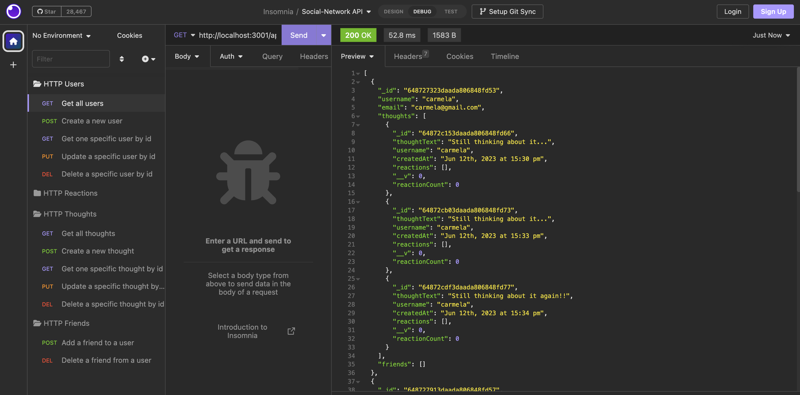
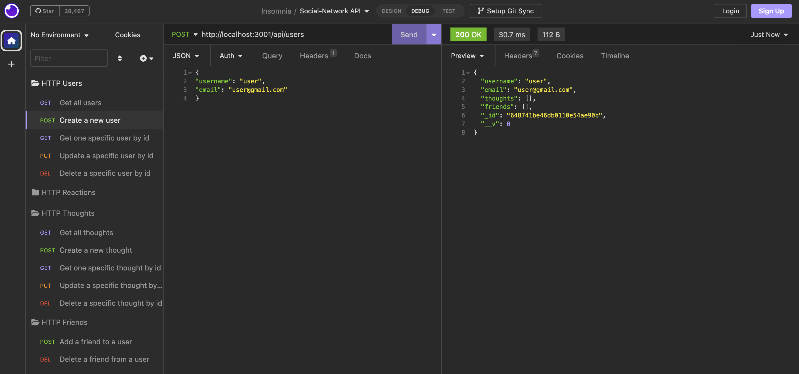

# Social Network API
API for a social network web app using Express.js for routing, a NoSQL db: MongoDB database, and the Mongoose ODM

## [Table of Contents](#table-of-contents)

- [Description](#description)
- [Final Result](#final-result)
- [Walkthrough Video](#walkthrough)
- [Installation](#installation)
- [Usage](#usage)
- [License](#license)
- [Contact Me](#contact)

## [Description](#table-of-contents)

API for a social network web application where users can share their thoughts, react to friends’ thoughts, and create a friend list. This social network uses Express.js for routing, a MongoDB database, and the Mongoose ODM. In addition to using these packages, it uses a JavaScript date library and Insomnia to create the data as no seed is provided.

NoSQL is a type of database management system that differs from traditional relational databases (SQL databases) in several ways. NoSQL databases are designed to handle large amounts of unstructured or semi-structured data, provide high scalability, and allow for flexible schema design.

Key concepts and features of NoSQL databases:

- Schema flexibility: NoSQL databases allow for flexible schema design, enabling developers to store and manipulate unstructured or semi-structured data without predefined schemas.

- Document-oriented: NoSQL databases, such as MongoDB, organize data into documents, which are self-contained and independent units that can store data in a variety of formats (e.g., JSON, XML) and have flexible schemas.

- Key-value stores: A type of NoSQL database where data is stored as a collection of key-value pairs, providing fast and efficient access to data based on unique keys.

- Columnar databases: NoSQL databases that store data in columns rather than rows, allowing for efficient data retrieval and analysis of specific columns.

- Graph databases: NoSQL databases that represent data as nodes, edges, and properties, providing efficient storage and traversal of complex relationships between data entities.

- High scalability and performance: NoSQL databases are designed to handle large amounts of data and provide horizontal scalability, allowing for easy distribution of data across multiple servers for increased performance and capacity.

- Eventual consistency: NoSQL databases prioritize high availability and partition tolerance over immediate consistency, meaning that updates made to the database eventually propagate to all replicas, ensuring eventual consistency across the system.

`Technologies used:`

- JavaScript
- Node.js
- Express.js
- NoSQL: MongoDB
- Mongoose
- NPM
- Nodemon
- Insomnia
- Rest API

## [Final Result](#table-of-contents)

## [Walkthrough](#walkthrough)

[Link to video](https://drive.google.com/file/d/1HOKYTHvXd9wEcYnVxNQmCwLpmgmDljD4/view)

## [Installation](#installation)

1. Install Node.js and MongoDB on your machine.
2. Clone the repository to your local system.
3. Open the repository in your preferred code editor.
4. Install the required dependencies by running the following command in the terminal:

> package.json: npm i

5. Start the app by running the following command in your terminal: 

> npm start

## [Usage](#table-of-contents)

To use this social network app, follow these steps:

1. Make sure the application is running by executing npm start.
2. Access the application through Insomnia.
3. Use an API development environment (e.g., Insomnia) to test the API routes using various HTTP request methods such as GET, POST, PUT, and DELETE:

<b>User HTTP requests: </b>

- Get all  users - GET - http://localhost:3001/api/users
- Get one user - GET - http://localhost:3001/api/users/usedId
- Create a user - POST - http://localhost:3001/api/users
- Update a user - PUT - http://localhost:3001/api/users/usedId
- Delete a user - DELETE - http://localhost:3001/api/users/userId

<b>Thoughts HTTP requests: </b>

- Get all  thoughts - GET - http://localhost:3001/api/thoughts
- Get one thought - GET - http://localhost:3001/api/thoughts/thoughtId
- Create a thought - POST - http://localhost:3001/api/thoughts
- Update a thought - PUT - http://localhost:3001/api/thoughts/thoughtId
- Delete a thought - DELETE - http://localhost:3001/api/thoughts/thoughtId

<b>Reactions HTTP requests: </b>

- Create a reaction - POST - http://localhost:3001/api/thoughts/thoughtId/reactions
- Delete a reaction - DELETE - http://localhost:3001/api/thoughts/thoughtId/reactions?reactionId=reactionId

<b>Friends HTTP requests: </b>

- Add a friend to a user - POST - http://localhost:3001/api/users/userId/friends/friendId
- Delete a friend from a user - DELETE - http://localhost:3001/api/users/:userId/friends/:friendId

## [License](#table-of-contents)

Licenced under:

[MIT](https://choosealicense.com/licenses/MIT)

## [Contact Me](#table-of-contents)

- [GitHub](https://github.com/cdrcar)

